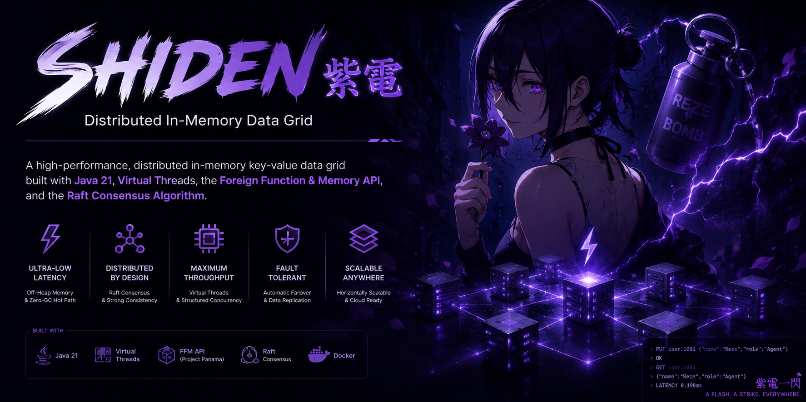

# ⚡ Shiden (紫電)
### *A Distributed, Off-Heap, Ultra-Low Latency In-Memory Data Grid (IMDG) Built from Scratch in Java 21*

[](https://openjdk.org/projects/jdk21)
[](#-warning-construction-zone)



> **Shiden** (named after the lightning-fast fighter aircraft *Shiden Kai*) is a pure-Java distributed in-memory data grid. It bypasses JVM runtime bottlenecks (like Garbage Collection pauses) by executing manual pointer-arithmetic over raw OS memory and scales connections using lightweight Virtual Threads.

---

> [!WARNING]
> ### 🚧 Hard Hat Zone: Under Construction 🚧
> This project is currently in the active R&D phase. Parts of the codebase may contain raw bytes fighting for survival, half-completed consensus protocols, and Virtual Threads wandering around looking for work. Enter at your own risk, and don't touch any unaligned memory pointers without a safety harness!

---

## 🚀 Systems Engineering vs. Standard Java

| Goal | The Easy Way | The Shiden Way |
| :--- | :--- | :--- |
| **Memory Control** | Let the JVM allocate objects and rely on GC to clean up. | Bypass JVM heap completely. Manually align memory and compute byte offsets with the **FFM API (`MemorySegment`)**. |
| **Concurrency** | Use standard platform thread pools (like Tomcat). | Bind client sockets to **Virtual Threads** and coordinate atomic node broadcasts using **Structured Concurrency**. |
| **Fault Tolerance** | Rely on managed cloud databases or replication frameworks. | Write a pure mathematical implementation of the **Raft Consensus Protocol** over custom binary TCP. |

---

## 🗺️ System Blueprint

To view the in-depth system architecture, protocol specifications, memory layouts, and roadmap, check out the detailed design document:

👉 **[Read the Technical Architecture Plan (plan/idea.md)](file:///home/moadabdou/coding/serious_projects/Shiden/plan/idea.md)**

---

## 💬 The GC's Reaction to Shiden

```
JVM GC: "Let me clean up those objects for you!"
Shiden: *Allocates everything off-heap using MemorySegment*
JVM GC: *Cries in 0B heap usage*
```
