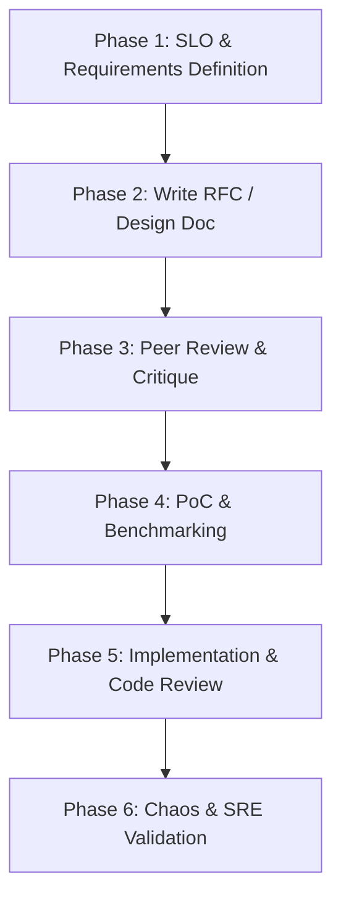

# Shiden (紫電) Simulated Big Tech Design Path

This document outlines the structured design, review, and engineering lifecycle for **Shiden**. It serves as a framework to simulate how a core systems engineering team at a big tech corporation (e.g., Google, Meta, AWS) designs, debates, and builds high-performance distributed infrastructure.

---

## 1. The Engineering Lifecycle Overview



---

## 2. Phase 1: Requirements & SLOs (Service Level Objectives)

Before choosing any technologies, define the strict non-functional constraints. In industry, missing these targets means project failure.

### Target SLOs for Shiden
* **Latency SLO:** p99 read/write latency must remain $< 2.0\text{ ms}$ under a load of 10,000 concurrent connections.
* **Garbage Collection (GC) SLO:** Zero Stop-The-World (STW) pauses originating from the database engine during steady-state operations (achieved via off-heap memory).
* **Consistency SLO:** Linearizable consistency for write operations on a key, managed through Raft-based state replication.
* **Availability SLO:** The cluster must remain write-available as long as a quorum ($\lfloor N/2 \rfloor + 1$) of nodes is healthy, and read-available on healthy nodes.

---

## 3. Phase 2: The RFC (Request for Comments) Template

For every major component (e.g., *Off-Heap Memory Manager*, *Raft Consensus Engine*, *Virtual Thread TCP Server*), you should write a short RFC using this template to force explicit architectural decisions.

```markdown
# RFC-XXX: [Component Name]

## 1. Abstract
A 3-5 sentence summary of what this component does, the problem it solves, and its high-level design.

## 2. Background & Goals
* What is the context? Why is this component necessary now?
* **In-Scope Goals:** What will this component solve?
* **Out-of-Scope (Non-Goals):** What are we explicitly NOT building to prevent scope creep?

## 3. Proposed Architecture
* Detailed design diagrams (Mermaid format).
* API/Interface definitions (interfaces, records, key public methods).
* Memory layout and data structures (especially critical for off-heap segments).

## 4. Cross-Node & Networking Protocol (If Applicable)
* Frame format (e.g., magic bytes, length prefixes, payload types).
* Serialization strategy (avoiding JVM object creation).

## 5. Alternatives Considered
* *Alternative A (e.g., Using JNI + C++ engine instead of Java FFM API):* Why was it rejected?
* *Alternative B (e.g., Using Netty instead of Java 21 Virtual Threads):* Why was it rejected?

## 6. SRE & Observability Plan
* **Metrics:** What telemetry is required (e.g., active off-heap bytes, Raft log index, CPU utilization)?
* **Failure Modes:** How does this component behave when disk space is full, memory is exhausted, or the network partitions?
```

---

## 4. Phase 3: The Review & Critique (Simulating Roles)

When reviewing your own design docs or code, wear different "hats" to stress-test your architecture:

| Role Hat | Focus Area | Critical Questions to Ask Yourself |
| :--- | :--- | :--- |
| **Principal Systems Architect** | Extensibility, Clean Abstractions, Simplicity | *Are we over-engineering? Can we simplify the state transitions in our Raft engine? Do our abstractions leak implementation details?* |
| **Performance Engineer** | Memory Overhead, Allocations, CPU Cache | *Are we creating short-lived objects in critical paths? Are virtual threads blocking on native monitors (synchronized blocks) causing thread pinning?* |
| **SRE / Production Engineer** | Failures, Monitoring, Operations | *What happens if a node runs out of native memory? Does it crash cleanly, or does it corrupt the Raft log? How do we debug a stuck consensus election?* |
| **Security Engineer** | Network safety, Memory isolation | *Are we validating input buffer sizes before writing to off-heap segments? Can a malformed network packet trigger an out-of-bounds memory write (Buffer Overflow)?* |

---

## 5. Phase 4: Prototyping & Benchmarking (PoC)

For systems programming, designs must be backed by raw benchmarks before proceeding to production implementation.

### Key Benchmark Strategies for Shiden
1. **Micro-benchmarking (JMH):** 
   * Write Java Microbenchmark Harness (JMH) tests for the off-heap allocator to measure operations/second and garbage allocation rate.
2. **GC Logging & Analysis:**
   * Run the prototype with `-XX:+UseZGC -Xlog:gc*` to monitor ZGC activity and ensure that memory reads/writes do not trigger GC cycles.
3. **Thread Pinning Profiling:**
   * Profile virtual threads using JDK Flight Recorder (JFR) to detect any carrier thread pinning caused by blocking calls inside `synchronized` blocks.

---

## 6. Phase 5: Implementation & Code Quality

* **Incremental Commits:** Code should be merged in small, logical chunks (e.g., writing the binary protocol parser first, then the TCP server wrapper, then integrating them).
* **Strict Thread Safety Guidelines:**
  * Document which classes are thread-safe and their synchronization primitives.
  * Prefer `ReentrantLock` and thread-safe collections over raw `synchronized` blocks when using virtual threads to prevent carrier thread pinning.
* **Manual Memory Safety Rules:**
  * Every off-heap allocation must have a corresponding, deterministic deallocation path (using Java 21 `Arena` or custom reference counting).
  * Use scope-bound arenas (`Arena.ofConfined()`) where possible to guarantee automatic release at the end of a transaction lifecycle.

---

## 7. Phase 6: Chaos & SRE Validation

Before marking a major system milestone as "Production-Ready," perform active chaos testing:
1. **Network Partition (Split-Brain) Simulation:**
   * Simulate a 3-node cluster and drop network packets between Node A and the rest. Verify that Node A steps down as leader and the remaining 2 nodes elect a new leader.
2. **Crash-Recovery Verification:**
   * Write data, kill a node forcefully (`kill -9`), restart it, and verify that the Raft state machine rebuilds its state perfectly from the write-ahead log (WAL).
3. **Leak Detection:**
   * Run continuous load tests for several hours and monitor process RSS (Resident Set Size) memory to verify that native memory does not leak.
