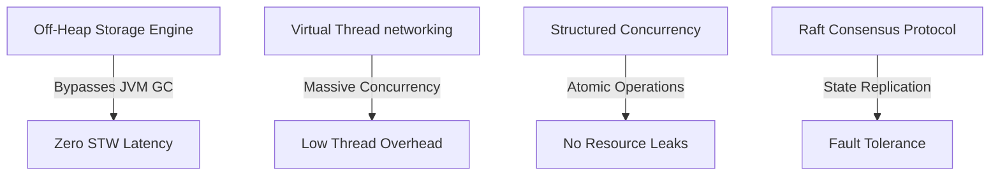

# Shiden (紫電): Project Vision & Core Goals

## 1. What is Shiden?

**Shiden** is a Distributed In-Memory Data Grid (IMDG) built from scratch in Java 21. Unlike traditional databases that store data on disk or rely on standard web servers and database frameworks, Shiden is a low-level systems infrastructure project. It acts as a network of interconnected servers pooling their random access memory (RAM) to share and manage data at extreme speeds.

By bypassing standard JVM runtime bottlenecks (like heap-based Garbage Collection) and heavy OS thread scheduling, Shiden is designed to demonstrate how enterprise-grade databases, message brokers, and distributed storage engines are built under the hood.

---

## 2. Why Build Shiden? (The Problem Statement)

1. **The GC Bottleneck:** Standard Java applications store objects on the JVM heap. When handling millions of concurrent cache read/write operations, the garbage collector initiates "Stop-The-World" pauses, resulting in unpredictable and catastrophic latency spikes.
2. **Thread Exhaustion:** Classic multi-threaded applications allocate one operating system thread per connection. At high scale (tens of thousands of concurrent clients), the OS spends more time context-switching between threads than doing actual work.
3. **Unreliable Networks:** In a distributed cluster, nodes crash, network packets drop, and network partitions occur. Maintaining a synchronized state across multiple servers without human intervention is a hard mathematical problem.

---

## 3. Engineering Goals of the Project

The ultimate objective of Shiden is not to build a standard application, but to prove mastery over the machine's hardware and network constraints.

* **Achieve Sub-Millisecond Latency:** Eliminate garbage collection pauses by manual pointer arithmetic and storing keys and values directly in native memory segments outside the JVM heap.
* **Massive Connection Concurrency:** Scale to tens of thousands of simultaneous client connections with minimal CPU overhead by binding network connections to lightweight Virtual Threads.
* **Orchestrate Atomic Task Failure:** Coordinate multi-node requests safely. If a replication call to one cluster node fails, all other related pending tasks must be automatically canceled to prevent resource leaks.
* **Implement Distributed Consensus:** Build a custom peer-to-peer state replication engine that uses mathematical consensus (Raft) to handle leader election and log replication over unstable networks.

---

## 4. Key Architectural Pillars

To achieve these goals, Shiden is structured around four technical pillars:

1. **Off-Heap Storage Engine (FFM API):** Utilizes Java 21's Foreign Function & Memory API to bypass the JVM Heap entirely, allocating and managing memory directly from the operating system.
2. **Lightweight Concurrent I/O:** Uses Java 21 Virtual Threads to allow non-blocking, highly concurrent client-server and inter-node TCP communication.
3. **Structured Concurrency:** Uses structured task scopes to handle parallel network broadcasts as a single, atomic unit of work.
4. **Consensus & Log Replication:** Implements the Raft Consensus Algorithm over a custom binary protocol to ensure the cluster remains consistent and self-healing.
