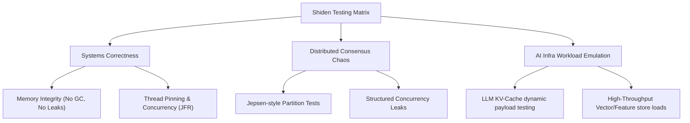

# Shiden (紫電) Testing Strategy & AI Infrastructure Verification Plan

This document outlines the testing strategy for **Shiden**, specifically focusing on validating its custom low-level systems architectures (Off-Heap FFM, Virtual Threads, Structured Concurrency, Raft) and verifying its suitability for **AI Infrastructure** workloads (e.g., LLM KV Caches, Feature Stores, Vector/Embedding lookups).

---

## 1. The Core Testing Matrix

Testing a low-level Systems project in Java 21 requires bypassing standard application-level testing frameworks. We need to validate hardware integration, OS-level thread scheduling, memory fragmentation, and distributed network partitions.



---

## 2. Systems-Level & Runtime Correctness

### A. Off-Heap Memory Integrity (FFM API)
Because Shiden uses the **Foreign Function & Memory (FFM) API** (`MemorySegment` and `Arena`), we manage memory manually outside the JVM heap. This introduces risks of segmentation faults, memory leaks, and memory fragmentation.

| Test Category | Target Vector | Validation Tooling & Methods |
| :--- | :--- | :--- |
| **Memory Leaks** | Arenas not being closed, leading to OS-level RSS growth. | Run tests with custom JVM flags `-Dforeign.restricted=permit` and monitor Resident Set Size (`RSS`) using `pmap` or `/proc/self/status`. Check JVM native memory tracking: `-XX:NativeMemoryTracking=summary`. |
| **Segmentation Faults & Alignment** | Accessing unaligned memory boundaries or out-of-bounds byte offsets. | Fuzz-test with variable key-value byte sizes. Force unaligned address writes to verify that your memory layout layers (e.g., using `VarHandle`) throw expected `IndexOutOfBoundsException` or `IllegalArgumentException` instead of crashing the JVM. |
| **Off-heap Fragmentation** | Long-running dynamic size allocations causing memory bloat due to dynamic sizing (common with variable tensor dimensions). | Write a long-running simulation simulating model output caches. Measure allocator efficiency (Allocated bytes vs. Overhead bytes). Propose a **Slab or Buddy Allocator** to manage block sizing. |

### B. Virtual Thread Pinning & Concurrency
Virtual threads in Java 21 run on a fork-join pool of carrier (platform) threads. If a virtual thread blocks inside a `synchronized` block or runs native code (like JNI-based vector operations), the carrier thread gets **pinned**, defeating the concurrency benefits.

*   **Pinning Detection Tests:**
    Run the test suite with:
    ```bash
    java -XX:+StartFlightRecording:settings=default,filename=recording.jfr \
         -Djdk.tracePinnedThreads=full \
         -jar shiden.jar
    ```
    *Verification:* Scan logs and JFR recordings for any `jdk.VirtualThreadPinned` events. If a carrier thread is pinned for more than a few microseconds, refactor the corresponding `synchronized` blocks to use `java.util.concurrent.locks.ReentrantLock`.
*   **Structured Concurrency Cancellation:**
    Verify that if a broadcast replica fails, the `StructuredTaskScope` shuts down and actively interrupts the remaining virtual threads.
    *Test Setup:* Spawn a client request that replicates to 3 follower nodes. Induce an artificial network delay or socket failure on Node 2. Confirm that the connections for Node 1 and Node 3 are immediately closed and virtual thread scopes are clean.

---

## 3. Distributed Consensus & Chaos (Raft Validation)

To verify the custom Raft implementation over raw binary TCP:

1.  **Jepsen-style Network Partitioning:**
    *   Deploy a 5-node Shiden cluster locally using Docker.
    *   Use `ip route` or `iptables` to drop packets between the Leader and other nodes (simulating a split-brain).
    *   *Verify:* The partitioned Leader steps down. The remaining 4 nodes elect a new Leader. When the partition heals, the old Leader catches up, truncates uncommitted log entries, and achieves consistency without losing acknowledged writes.
2.  **State Machine Replication Safety:**
    *   Hammer the cluster with concurrent writes (10,000 requests/sec).
    *   Kill a follower mid-request, then restart it.
    *   *Verify:* Verify the CRC32 checksums of all keys and values in the off-heap segments across all alive nodes to confirm exact replica equality.

---

## 4. Testing Specifically for AI Infrastructure

AI workloads have unique data shapes and access patterns that put extreme stress on an IMDG compared to traditional web applications.

```
       AI Workload Characteristics vs. Shiden Design Requirements
┌─────────────────────────────────┐      ┌─────────────────────────────────┐
│     Traditional Web Caching     │      │         AI Infrastructure       │
├─────────────────────────────────┤      ├─────────────────────────────────┤
│ • Small payloads (JSON, < 1KB)  │  vs  │ • Large payloads (Tensors, MBs) │
│ • Evenly distributed access     │      │ • High temporal read skews      │
│ • Tolerant to occasional spikes │      │ • Sub-ms strict p99 requirement │
└─────────────────────────────────┘      └─────────────────────────────────┘
```

Here are 3 specialized test suites proposed to certify Shiden for AI:

### A. Test Suite 1: LLM KV-Cache Serving & Latency Spikes
*   **Context:** In multi-tenant LLM serving (e.g., vLLM, HuggingFace TGI), the attention Key-Value (KV) cache tensors are stored/retrieved for long-context prompts. Storing these off-heap allows multi-node model instances to share KV caches without triggering JVM garbage collection pauses.
*   **Workload Emulation:**
    *   **Payload sizes:** Dynamic float arrays representing token embeddings (typically 128KB to 8MB per KV segment).
    *   **Access Pattern:** Frequent write updates (appending newly generated tokens) and rapid read bursts (prefill phases).
*   **Testing Method:**
    *   Generate sequences of write/read ratios modeling LLM decoding (e.g., 90% read, 10% write).
    *   Benchmark the end-to-end latency with **p99 and p99.9 metrics**.
    *   *Goal:* Maintain sub-millisecond p99 response times for values up to 5MB, proving the zero-GC off-heap architecture is keeping up with token generation rates (e.g., 20–50 tokens/sec per stream).

### B. Test Suite 2: Feature Store Lookup Concurrency
*   **Context:** ML models deployed in real-time ad ranking, fraud detection, or search recommendations pull raw feature vectors from the IMDG during inference.
*   **Workload Emulation:**
    *   **Concurrency:** Simulate 10,000+ simultaneous virtual thread connections fetching model features.
    *   **Read Skew:** A small subset of features (hot keys) are accessed repeatedly.
*   **Testing Method:**
    *   Write a client mock that creates 15,000 concurrent virtual threads performing point lookups using a Zipfian distribution (hot-key bias).
    *   *Goal:* Validate that the network thread-pool scales without virtual thread context-switching overhead and the FFM memory-segment reads are thread-safe and lock-free (using read-copy-update or fine-grained read locks).

### C. Test Suite 3: Zero-Serialization Vector Streaming
*   **Context:** Serializing high-dimensional float vectors (e.g., 1536-dimension embeddings) from the JVM Heap to raw bytes is computationally expensive.
*   **Workload Emulation:**
    *   Retrieval of float arrays directly.
*   **Testing Method:**
    *   Measure serialization/deserialization time compared to standard Java Serialization.
    *   *Verify:* Build a test using `MemorySegment.asByteBuffer()` to map off-heap data directly into Java's NIO sockets. Confirm that zero JVM objects are allocated during read-to-socket transfers (Zero-Copy transfers).

---

## 5. Summary of Recommended Tooling

To execute this testing plan, the following toolkit is recommended:

| Tool | Purpose | Status in Java/Systems Ecosystem |
| :--- | :--- | :--- |
| **JMH (Java Microbenchmark Harness)** | Benchmark FFM raw read/write speeds against standard JVM Heap arrays. | Standard JDK tool |
| **JDK Flight Recorder (JFR) + JDK Mission Control** | Profile CPU, thread state, monitor carrier thread pinning, and count raw off-heap allocations. | Integrated in Java 21 |
| **Jepsen (or custom bash scripts)** | Simulate network splits, latency injects (`tc netem`), and sudden process terminations. | Industry standard for consensus validation |
| **wrk2 or k6 (configured with TCP)** | Generate sustained high-throughput concurrent client requests to stress-test virtual threads. | High-performance load testers |
