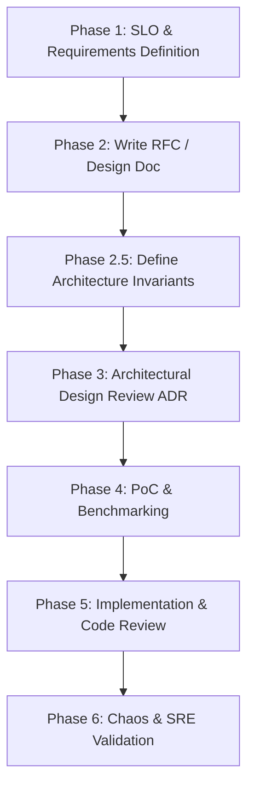

# Shiden (紫電) Simulated Big Tech Design Path

This document outlines the structured design, review, and engineering lifecycle for **Shiden**. It serves as a framework to simulate how a core systems engineering team at a big tech corporation (e.g., Google, Meta, AWS) designs, debates, and builds high-performance distributed infrastructure.

---

## 1. The Engineering Lifecycle Overview



---

## 2. Phase 1: Requirements & SLOs (Service Level Objectives)

Before choosing any technologies, define the strict non-functional constraints. In industry, missing these targets means project failure.

### Target SLOs for Shiden
* **Latency SLO:** p99 read/write latency must remain $< 2.0\text{ ms}$ under a load of 10,000 concurrent connections.
* **Garbage Collection (GC) SLO:** Zero Stop-The-World (STW) pauses originating from the database engine during steady-state operations (achieved via off-heap memory).
* **Consistency SLO:** Eventual consistency for write operations across the cluster (v1.0 AP mode), with an option for linearizable consistency in future configurations.
* **Availability SLO:** The cluster must remain write-available on any healthy node, utilizing asynchronous replication and Gossip protocol for topology updates.

---

## 3. Phase 2: The RFC (Request for Comments) Template

For every major component, write a short RFC using this template to force explicit architectural decisions.

```markdown
# RFC-XXX: [Component Name]

## 1. Abstract
A 3-5 sentence summary of what this component does, the problem it solves, and its high-level design.

## 2. Background & Goals
* **In-Scope Goals:** What will this component solve?
* **Out-of-Scope (Non-Goals):** What are we explicitly NOT building to prevent scope creep?

## 3. Proposed Architecture
* Detailed design diagrams (Mermaid format).
* Memory & Concurrency Safety (How are we avoiding locks?)

## 4. Dependencies & Interfaces
* How does this connect to lower-level RFCs?

## 5. Alternatives Considered
* Why were other standard approaches rejected?

## 6. Guarantees
* What absolute invariants does this RFC establish for the system?
```

---

## 4. Phase 2.5: Architecture Invariants (The Constitution)

Before writing code, extract the absolute guarantees from the RFCs into a single "Constitution." Whenever an RFC changes or code is written, it is validated against these invariants. If an invariant is broken, the design is flawed.

### Shiden Core Invariants
* **Invariant 1:** Exactly one OS thread owns a Logical Partition.
* **Invariant 2:** Exactly one physical node owns a Logical Partition for a specific Topology Version.
* **Invariant 3:** Every mutation generates exactly one unique Replication Sequence Number (RSN).
* **Invariant 4:** Replication, Persistence, and Execution strictly follow RSN ordering.
* **Invariant 5:** The Write-Ahead Log (WAL) is strictly append-only.
* **Invariant 6:** Memory ownership strictly follows thread execution ownership (Shared-Nothing).
* **Invariant 7:** Transactions (MULTI/EXEC/Lua) never span multiple partitions.
* **Invariant 8:** Replicas never accept client write commands.
* **Invariant 9:** The Netty EventLoop never performs blocking disk I/O.
* **Invariant 10:** The Partition Thread never performs blocking network/disk I/O.

---

## 5. Phase 3: Architectural Design Review (ADR)

Rather than casually reviewing an RFC, conduct a formal Architectural Design Review (ADR). This keeps the RFC immutable while recording the design decisions, objections, and scoring.

### 5.1. The Review Order (Bottom-Up)
RFCs must be reviewed in strict dependency order, not chronological numbering. If a low-level RFC changes, it cascades upwards.
`Storage` $\rightarrow$ `Memory` $\rightarrow$ `Execution` $\rightarrow$ `Networking` $\rightarrow$ `Membership` $\rightarrow$ `Replication` $\rightarrow$ `Persistence` $\rightarrow$ `Transactions` $\rightarrow$ `Operations` $\rightarrow$ `Coordination`

### 5.2. The Review Hats
When reviewing, evaluate the architecture from six distinct engineering perspectives:

| Role Hat | Focus Area | Critical Questions |
| :--- | :--- | :--- |
| **Principal Architect** | Extensibility, Abstractions | *Can a Partition migrate while processing requests? Does this leak state?* |
| **Performance Engineer** | Cache, Memory, Allocations | *How many cache lines does the mailbox occupy? Are we allocating on the hot path?* |
| **Distributed Systems** | Consensus, CAP, Split-Brain | *Can two nodes own the same partition during a topology change?* |
| **JVM Runtime Engineer** | Panama, FFM, NUMA, JIT | *Can the Panama Arena close while a MemorySegment is still referenced?* |
| **SRE / Production** | Failures, Ops, Monitoring | *How do I detect a partition stuck for 30 seconds?* |
| **Security Engineer** | Network safety, OOB | *Can a malformed packet enqueue an invalid PartitionID?* |

### 5.3. The ADR Template
```markdown
# ADR-XXX: [Component] Review

**Reviewers:**
* Architect: [Notes]
* Performance: [Notes]
* Distributed Systems: [Notes]
* JVM Runtime: [Notes]
* SRE: [Notes]
* Security: [Notes]

**Issues Found:**
1. ...
2. ...

**Decision:** [Approved / Rejected / Requires Changes]

**Action Items:**
- [ ] Fix X in RFC
- [ ] Implement Y

**Scorecard:**
* Correctness: 9/10
* Performance: 10/10
* Operability: 8/10
* Security: 7/10
* Complexity: 9/10
* Extensibility: 9/10
```

---

## 6. Phase 4: Prototyping & Benchmarking (PoC)

For systems programming, designs must be backed by raw benchmarks before proceeding to production implementation.
1. **Micro-benchmarking (JMH):** Measure operations/second and garbage allocation rate for the lock-free queues and off-heap FFM accesses.
2. **GC Logging & Analysis:** Run with `-XX:+UseZGC -Xlog:gc*` to ensure steady-state operations trigger zero GC cycles.

---

## 7. Phase 5: Implementation & Code Quality

* **Incremental Commits:** Code should be merged in small, logical chunks.
* **Strict Thread Safety Guidelines:** Document which classes are thread-safe and their synchronization primitives (MPSC vs SPSC vs Single-Threaded).
* **Manual Memory Safety Rules:** Every off-heap allocation must have a corresponding, deterministic deallocation path (using Java 21 `Arena` and reference counting).

---

## 8. Phase 6: Chaos & SRE Validation

Before marking a major system milestone as "Production-Ready," perform active chaos testing:
1. **Network Partition (Split-Brain) Simulation:** Drop network packets between nodes. Verify the Gossip protocol detects the failure and the Hash Ring deterministically promotes replicas.
2. **Crash-Recovery Verification:** `kill -9` a node, restart it, and verify that it rebuilds its off-heap state perfectly from the WAL and Snapshots.
3. **Leak Detection:** Run continuous load tests and monitor process RSS to verify native memory does not leak.
